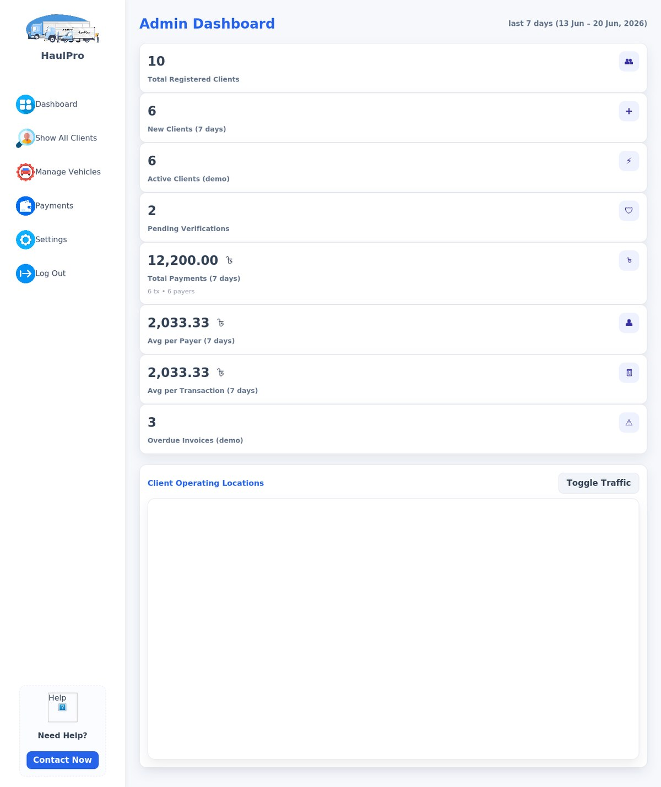

# 🚚 HaulPro — Truck & Logistics Management System

A full-stack **web app for running a trucking / haulage business**, built with **PHP, MySQL and vanilla JS**. HaulPro unifies fleet operations, driver and truck management, monthly billing, payments and business analytics in one dashboard — and adds a **data-aware AI assistant** and a **dark / light theme**.

<p align="center">
  
</p>

<p align="center">
  
  
  
  
  
</p>

> ⚠️ **Security note (please read):** a live `OPENROUTER_API_KEY` is currently committed to this repository (in `.env` and `.htaccess`). Anyone can copy it and spend against your account. **Revoke / rotate that key now**, remove those files from the repo, add them to `.gitignore`, and purge them from git history (e.g. with `git filter-repo` or BFG). Never commit real API keys.

---

## ✨ Features

- **Secure authentication** — email/password login & registration with bcrypt hashing and PHP sessions; queries use prepared statements.
- **Operations dashboard** — live KPI tiles (vehicles, active fleet, pending/accepted/pickup/completed/cancelled loads, monthly earnings) computed from the database, plus a live-tracking map panel.
- **Admin area** — manage clients, vehicles and payments, review/approve billing transactions, and configure settings.
- **Driver & lorry-owner management** — full CRUD for drivers and vehicles (type, owner, capacity, contact, status, notes).
- **Truck fleet board** — add trucks and track each one's driver, status, current load, location and ETA.
- **Trip history** — a filterable ledger (last 10 days / 30 days / 6 months / year / all) with route, distance, revenue, expense and profit per trip, plus printable receipts.
- **Monthly billing & payments** — billing cycles, customer-submitted payments (bKash / Nagad / bank), and an admin approval flow.
- **Business analytics** — Revenue, Fleet and Delivery-Performance pages with KPI cards and **Chart.js** charts.
- **AI assistant** — an in-app chatbot (via the OpenRouter API) that grounds its answers in your own database tables.
- **Light / dark theme** toggle and a trip **distance calculator** with a map view.

---


## 🛠️ Tech Stack

| Layer | Technology |
|---|---|
| Backend | PHP (procedural, `mysqli` with prepared statements; PDO in the chatbot) |
| Database | MySQL / MariaDB |
| Frontend | HTML5, CSS3 (custom properties, light/dark themes), vanilla JavaScript |
| Charts | Chart.js |
| AI | OpenRouter Chat Completions API (DB-grounded responses) |
| Maps | Google Maps embed (`maps.html`) |
| Auth | bcrypt password hashing + PHP sessions |

---

## 📁 Project Structure

```
WebTech_Project/
├── db.php / auth.php           # DB connection + session helpers
├── login.php / logout.php      # Auth
│
├── Dashboard.php               # Operations dashboard (KPIs + map)
├── adminDashboard.php          # Admin dashboard
├── adminShowClients.php        # Registered clients
├── adminManageVehicles.php     # Vehicle management
├── adminPayment.php            # Review/approve client payments
├── adminSettings.php           # Admin settings
│
├── Lorry_owner.php             # Lorry owner + driver CRUD
├── lorrylist.php               # Simple lorry list
├── Lorry_List.php              # Trip-history ledger (filterable)
├── Truck_list.php              # Truck fleet board
├── add_truck.php               # Add-truck JSON endpoint
│
├── Payment_customer.php        # Customer payment center (billing)
├── Customer_settings.php       # Customer profile settings
├── receipt.php                 # Printable receipt
│
├── Revenue_analysis.php        # Revenue analytics (Chart.js)
├── fleet_analysis.php          # Fleet analytics
├── delivery_performance.php    # Delivery KPIs
│
├── calculationInput.php        # Trip / distance calculator UI
├── calculate_distance.php      # Distance lookup endpoint
├── ai_chatbot.php              # DB-grounded AI assistant (OpenRouter)
├── action.php                  # Shared AJAX actions
├── FAQ.html / maps.html        # Static FAQ & map pages
│
├── light.css / dark.css / *.css  # Themes & styles
├── Image/                      # Logos, icons, illustrations (+ screenshots)
├── .env / .htaccess            # Config  ⚠️ contains secrets — see note above
└── schema.sql                  # Database schema (see Getting Started)
```

---

## 🗄️ Database

The app connects to a MySQL database named **`webtech_project`** (configured in `db.php`) and uses these tables:

`users`, `drives` (drivers), `lorry_owners`, `truck_data`, `trip_history`, `trips`, `billing_cycles`, `billing_payments`, `billing_prefs`.

> Some tables are auto-created after a user logs in, but `truck_data`, `trip_history` and `trips` are **not** — so importing `schema.sql` is required for the truck list, trip history and dashboard/analytics pages to work.

---

## 🚀 Getting Started

### Prerequisites
- PHP 8.x with `mysqli`, `pdo_mysql` and `curl` extensions
- MySQL or MariaDB
- A local stack such as **XAMPP**, **WAMP**, **Laragon**, or PHP's built-in server

### Setup

1. **Clone** into your web root:
   ```bash
   git clone https://github.com/Pawky007/WebTech_Project.git
   ```
2. **Create the database and import the schema:**
   ```bash
   mysql -u root -p -e "CREATE DATABASE IF NOT EXISTS webtech_project CHARACTER SET utf8mb4;"
   mysql -u root -p webtech_project < schema.sql
   ```
3. **Check `db.php`** and update the credentials if needed (defaults: host `localhost`, user `root`, empty password, db `webtech_project`).
4. **Configure the AI assistant (optional):** put your own key in `.env` as `OPENROUTER_API_KEY=sk-or-v1-...`. Keep `.env` out of version control.
5. **Run it.** With XAMPP, start Apache + MySQL and open `http://localhost/WebTech_Project/login.php`, or use the built-in server:
   ```bash
   php -S localhost:8000
   ```
6. **Register** an account, then sign in to reach the dashboard.

> The distance calculator includes a small built-in city distance table; the map view in `maps.html` needs a valid Google Maps API key to show tiles.

---

## 📝 Notes & Possible Improvements

- **Rotate and remove the committed API key** (see the security note above) — this is the most important fix.
- Add a **role column** (admin vs. customer) so admin pages are access-controlled rather than reachable by any logged-in user.
- Normalize the `truck_data` / `trip_history` tables (column names with spaces make queries fragile) and link them to `trips` by foreign keys.
- Move DB credentials and API keys into environment variables, add CSRF protection, and validate inputs server-side.
- Ship the schema with optional seed data so dashboards have demo content on first run.

---

## 👤 Author

Created by **[Pawky007](https://github.com/Pawky007)**.
Repository: [WebTech_Project](https://github.com/Pawky007/WebTech_Project)

If you find this project useful, consider giving it a ⭐ on GitHub!
